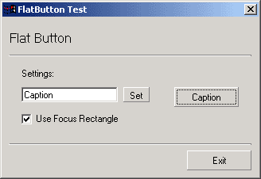



## API Flat Button Control

### Description

This Usercontrol contains no other controls(eg. lines, shapes) whatsoever, and is drawn entirely by API functions.

It is very lighweight and uses very few ressources from the computer.

Please vote for me.
 
### More Info
 

             |
---                |---
**Submitted On**   |2003-02-25 08:48:04
**By**             |[Dondata](https://github.com/Planet-Source-Code/PSCIndex/blob/master/ByAuthor/dondata.md)
**Level**          |Intermediate
**User Rating**    |3.8 (15 globes from 4 users)
**Compatibility**  |VB 5\.0, VB 6\.0
**Category**       |[Custom Controls/ Forms/  Menus](https://github.com/Planet-Source-Code/PSCIndex/blob/master/ByCategory/custom-controls-forms-menus__1-4.md)
**World**          |[Visual Basic](https://github.com/Planet-Source-Code/PSCIndex/blob/master/ByWorld/visual-basic.md)
**Archive File**   |[API\_Flat\_B1550202252003\.zip](https://github.com/Planet-Source-Code/dondata-api-flat-button-control__1-43511/archive/master.zip)

### API Declarations

A few

